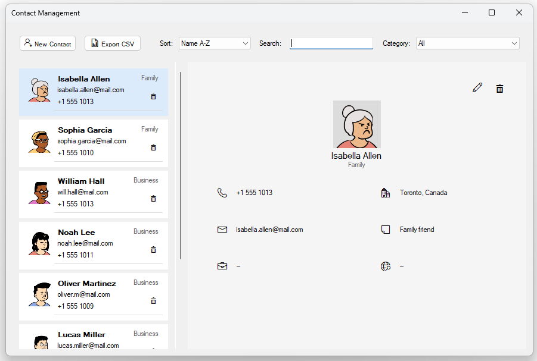
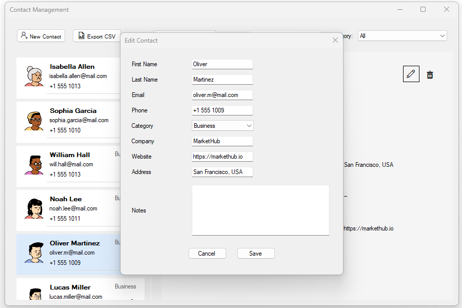

# Contact Management (WinForms)
Desktop application for managing contacts built with WinForms and SQLite.

## Compatibility
Developed using .NET Framework 4.7.2 to support older Windows configurations.

## ✨ Features
- Create, edit and delete contacts
- Search and category filtering
- Custom ContactCard UserControl
- CSV export
- Avatar support
- Input validation and error handling

## 🛠 Tech Stack
- .NET Framework 4.7.2
- WinForms
- SQLite (ADO.NET)
- MVP pattern

## 📸 Screenshots

### Main window

### Contact editor

## 🚀 How to run
1. Open solution in Visual Studio.
2. Build solution.
3. Run WinForms project.
4. Database is created automatically.

## 🧱 Architecture
Project uses:
- MVP pattern
- Service + Repository layers
- Dependency Injection

## 👤 Author
Taras Lyshak